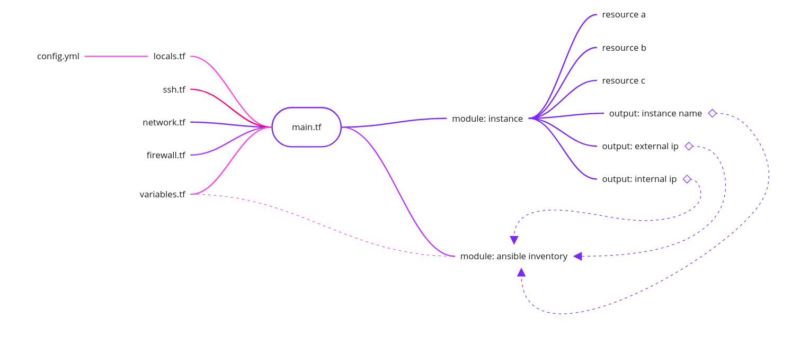
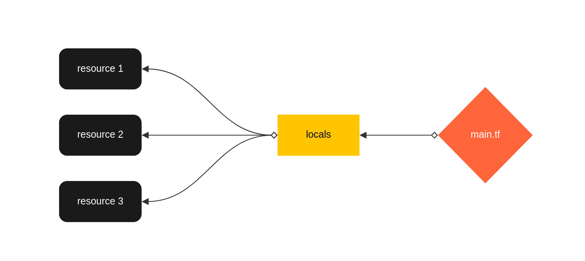

# Genereal #

## Providers covered ##
Google Cloud Prlatform(GCP) - https://registry.terraform.io/providers/hashicorp/google/latest/docs \
Amazon Web Services(AWS) - https://registry.terraform.io/providers/hashicorp/aws/latest/docs \
Hetzner cloud - https://registry.terraform.io/providers/hetznercloud/hcloud/latest/docs \
Scaleway cloud - https://registry.terraform.io/providers/scaleway/scaleway/latest/docs 

# You will NOT find here #
## How to deal with provider settings ##
How to store API credentials is your responsibility. There are a lot of approaches. 
We strongly reco### How to deal with provider settings ###mmend to not using credentials as a plaintext in your configuration files.
Instead of recommend something specific, we will just provide some links: \
Credetials-helpers - https://www.terraform.io/internals/credentials-helpers \
GCP - https://registry.terraform.io/providers/hashicorp/google/latest/docs/guides/getting_started#configuring-the-provider \
AWS - https://registry.terraform.io/providers/hashicorp/aws/latest/docs#authentication-and-configuration 

## How to store tfstate ##
Don't store state locally, use gcp/aws buckets as a backend instead of(or smth simmiral).
Remote backend with locks is MUST HAVE for teamwork.
- So why can't I see backet configuration? 
- Answer: Remote backend needs credentials. How to deal with secrets is up to you. :)

# Architecture #
## Files and folders structure ##
For excepting mistakes some files and folders are presented as a symlinks. For example you should not edit locals.tf or main.tf in each project as their should be same independ of project.
```
.
├── gen_links.py
|
├── core_modules
│   ├── ansible_inventory
│   │   ├── inventory.tmpl
│   │   ├── main.tf
│   │   └── variables.tf
│   └── ansible_inventory.old
│       ├── inventory.tmpl
│       ├── main.tf
│       └── variables.tf
├── aws
│   ├── common
│   │   ├── locals.tf
│   │   └── main.tf
│   ├── modules
│   │   └── instance
│   │       ├── main.tf
│   │       ├── outputs.tf
│   │       └── variables.tf
│   └── projects
│       └── kusama
│           ├── config.yml
│           ├── firewall.tf
│           ├── locals.tf -> ../../common/locals.tf
│           ├── main.tf -> ../../common/main.tf
│           ├── modules
│           │   ├── ansible_inventory -> ../../../../core_modules/ansible_inventory/
│           │   └── instance -> ../../../modules/instance/
│           ├── network.tf
│           ├── ssh.tf
│           └── variables.tf
├── gcp
│   ├── common
│   │   ├── locals.tf
│   │   └── main.tf
│   ├── modules
│   │   └── instance
│   │       ├── main.tf
│   │       ├── outputs.tf
│   │       └── variables.tf
│   └── projects
│       └── kusama
│           ├── config.yml
│           ├── firewall.tf
│           ├── locals.tf -> ../../common/locals.tf
│           ├── main.tf -> ../../common/main.tf
│           ├── modules
│           │   ├── ansible_inventory -> ../../../../core_modules/ansible_inventory/
│           │   └── instance -> ../../../modules/instance/
│           ├── ssh.tf
│           └── variables.tf
|
├── hetzner
│   ├── common
│   │   ├── locals.tf
│   │   └── main.tf
│   ├── modules
│   │   └── instance
│   │       ├── main.tf
│   │       ├── outputs.tf
│   │       └── variables.tf
│   └── projects
│       └── kusama
│           ├── config.yml
│           ├── firewall.tf
│           ├── locals.tf -> ../../common/locals.tf
│           ├── main.tf -> ../../common/main.tf
│           ├── modules
│           │   ├── ansible_inventory -> ../../../../core_modules/ansible_inventory/
│           │   └── instance -> ../../../modules/instance/
│           ├── network.tf
│           ├── ssh.tf
│           └── variables.tf
└── scaleway
    ├── common
    │   ├── locals.tf
    │   └── main.tf
    ├── modules
    │   └── instance
    │       ├── main.tf
    │       ├── outputs.tf
    │       └── variables.tf
    └── projects
        ├── compound
        │   ├── config.yml
        │   ├── firewall.tf
        │   ├── locals.tf -> ../../common/locals.tf
        │   ├── main.tf -> ../../common/main.tf
        │   ├── modules
        │   │   ├── ansible_inventory -> ../../../../core_modules/ansible_inventory/
        │   │   └── instance -> ../../../modules/instance/
        │   ├── ssh.tf
        │   └── variables.tf
        └── moonriver
            ├── config.yml
            ├── firewall.tf
            ├── locals.tf -> ../../common/locals.tf
            ├── main.tf -> ../../common/main.tf
            ├── modules
            │   ├── ansible_inventory -> ../../../../core_modules/ansible_inventory/
            │   └── instance -> ../../../modules/instance/
            ├── ssh.tf
            └── variables.tf

```


## Basics ##
Covered ONLY computing. 
You will NOT find here any resources like IAM, k8S, buckets and many many other cloud services.


## Resource mapping ##
Meaning things like:
1. security groups
2. VPC and networking
3. SSh keys




## config.yml ##
File where you define instances(by groups) and their specifications.

Bellow an short explanation:

```
prefix: gcp                                                       # part of generated inventory file name (`prefix`_`instance-group`.yml)
project: compound                                                 # part of inventory path(folder) (inventory/`project`/`prifix`_`instance-gruoup`.yml)

instances:                                                                                    
  validator:                                                      # Group of instances. Will be added to ansible inventory as a hosts group. https://docs.ansible.com/ansible/latest/user_guide/intro_inventory.html
    boot_disk_image: ubuntu-os-cloud/ubuntu-2004-lts              # Boot disk image. Can be overridden for extact machibe 
    boot_disk_size: 20                                            # Boot disk size. Can be overridden for extact machibe 
    extended_disk_type: pd-ssd                                    # An additional disk type. Can be overridden for extact machibe
    extended_disk_size: 50                                        # An additional dist size. Can be overridden for extact machibe
    extended_disk_name: sdb                                       # An additional disk name. Will be added to ansible host var. Bootstrap.yml will try to mount this disk. Can be overridden for extact machibe
    machines:                                                     
      instance_name:                                              # Instance name. Will be as an ansible_host. 
        region: us-west1                                          # Region where machine will be deployed. Can be overridden for machine group
        zone: us-west1-a                                          # Zone where machine will be deployed. Can be overridden for machine group
```

## locals.yml ##
File which presented as a symlink in each project which map all parameters from config.yml. 

# How to use, step-by-step #
1. create project directory ```mkdir infra/aws/projects/test_project```
2. Add project to gen_links.py (to "data" dictionary) and run script ```cd infra && python3 gen_lynks.py```
3. Create ```config.yml```, ```ssh.tf```, ```firewall.tf```, ```network.tf```, ```variables.tf```
4. Create ```backend.tf``` ``and provider.tf``
5. ```terraform init```
6. ```terraform apply``` 
7. Enjoy:)